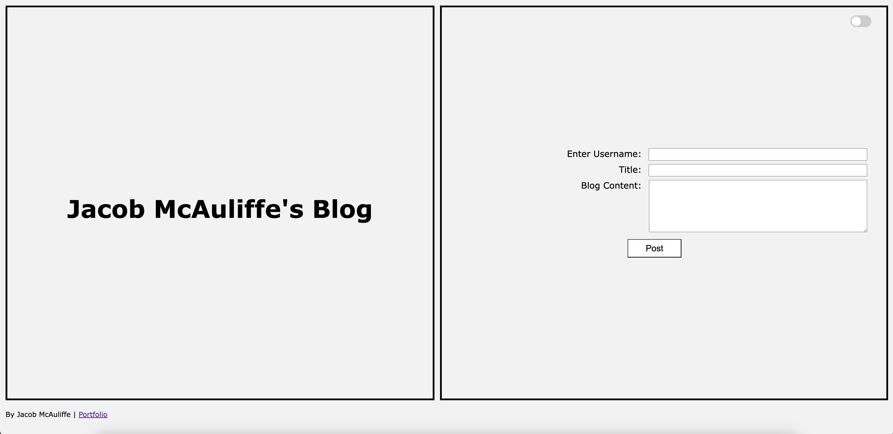
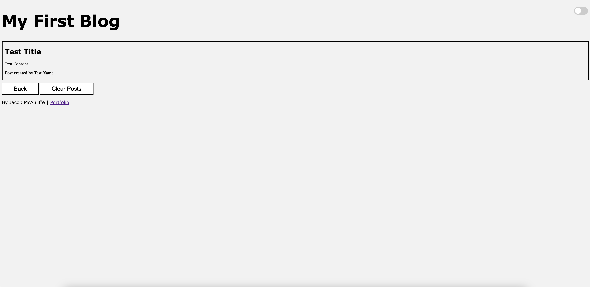

# 04-Personal-Blog

## Description

This is my repository for the UC Berkeley eDX Bootcamp's challenge for Week 4: Web APIs. I completed this challenge to display my understanding of advanced JavaScript principles and APIs, including concepts such as the window object, the DOM, event listeners, and local storage.

This repository contains the code for a two-page personal blog website. It allows users to input blog posts on the first page (index.html), which are then posted onto the second page (blog.html). Blog posts are all stored to local storage, and display the post's author, title, and content. From the second page, users can return to the first page to post again using the Back button, and/or press the Clear Posts button to clear the page/local storage of posts. The website also allows the user to switch between light and dark mode.

This project utilizes fundamental JavaScript concepts to display what I have learned this past four weeks in a practical, encompassing website.

## Installation

To install, please clone this repository to your computer using the following steps:

1. Click the "Code" dropdown menu and copy the SSH URL.
2. Open your terminal and navigate to the directory you would like to clone this repository into.
3. Type "git clone <paste SSH URL>", replacing <paste SSH URL> with your copied SSH URL.
4. Press enter.

## Usage

To view this site, either visit the link <https://jacobmca.github.io/04-Personal-Blog/index.html> or open the 04-Personal-Blog/index.html file on any major browser from your computer.

## Screenshots

## Credits

Created by Jacob McAuliffe for the UC Berkeley eDX Coding Boot Camp.

## License

MIT License

Copyright (c) 2024 Jacob McAuliffe

Permission is hereby granted, free of charge, to any person obtaining a copy
of this software and associated documentation files (the "Software"), to deal
in the Software without restriction, including without limitation the rights
to use, copy, modify, merge, publish, distribute, sublicense, and/or sell
copies of the Software, and to permit persons to whom the Software is
furnished to do so, subject to the following conditions:

The above copyright notice and this permission notice shall be included in all
copies or substantial portions of the Software.

THE SOFTWARE IS PROVIDED "AS IS", WITHOUT WARRANTY OF ANY KIND, EXPRESS OR
IMPLIED, INCLUDING BUT NOT LIMITED TO THE WARRANTIES OF MERCHANTABILITY,
FITNESS FOR A PARTICULAR PURPOSE AND NONINFRINGEMENT. IN NO EVENT SHALL THE
AUTHORS OR COPYRIGHT HOLDERS BE LIABLE FOR ANY CLAIM, DAMAGES OR OTHER
LIABILITY, WHETHER IN AN ACTION OF CONTRACT, TORT OR OTHERWISE, ARISING FROM,
OUT OF OR IN CONNECTION WITH THE SOFTWARE OR THE USE OR OTHER DEALINGS IN THE
SOFTWARE.

